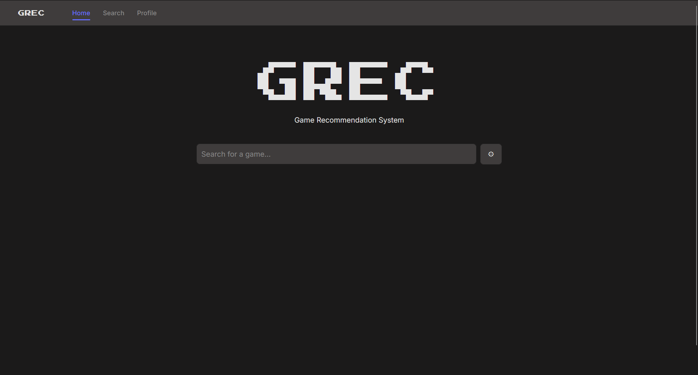
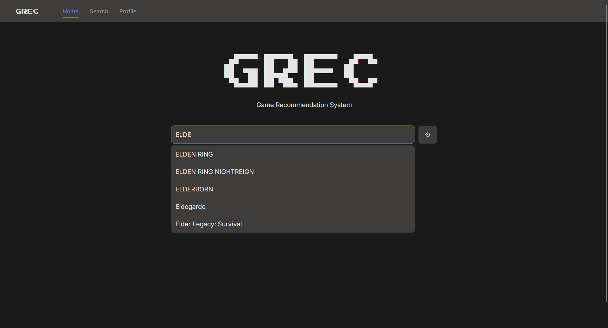
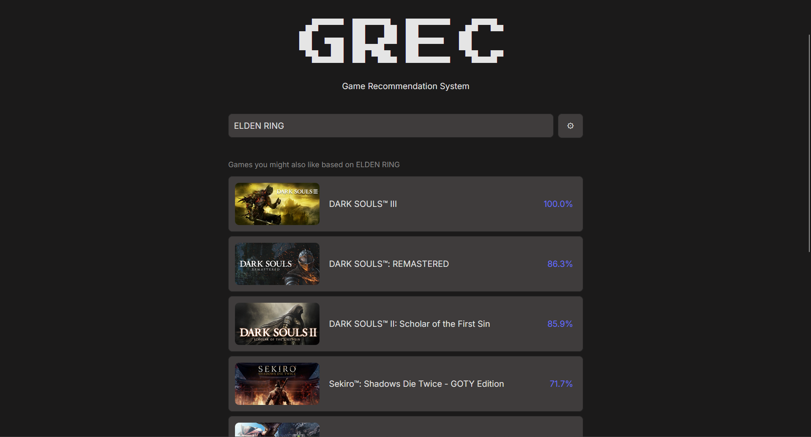
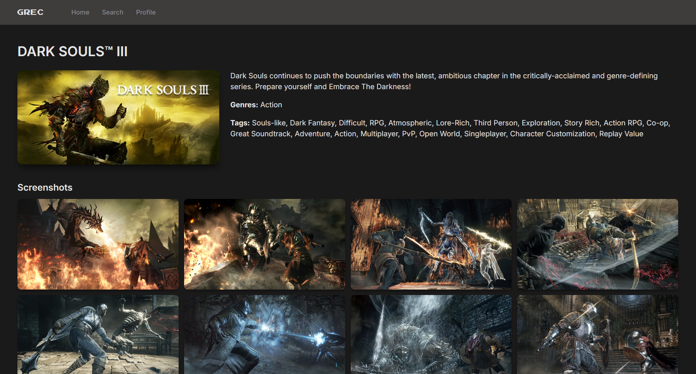
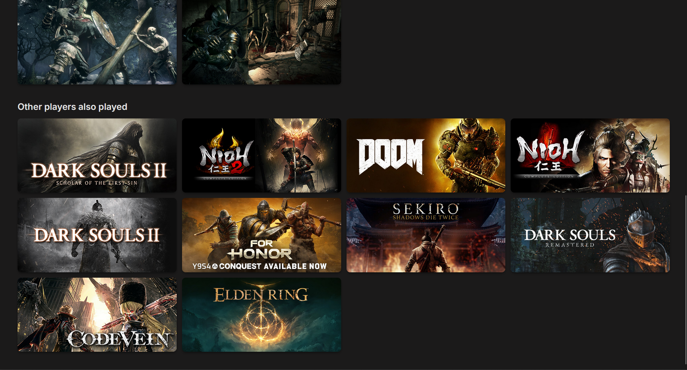
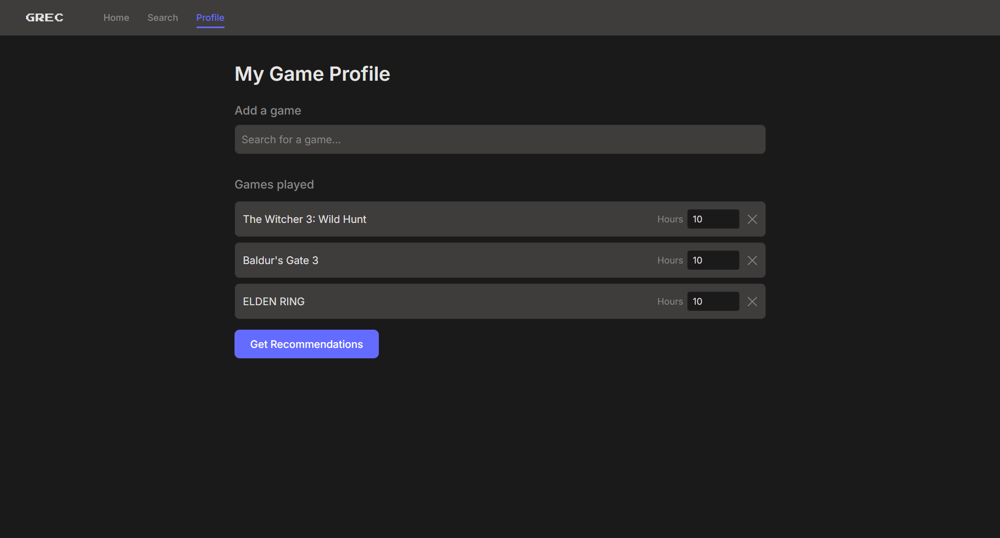
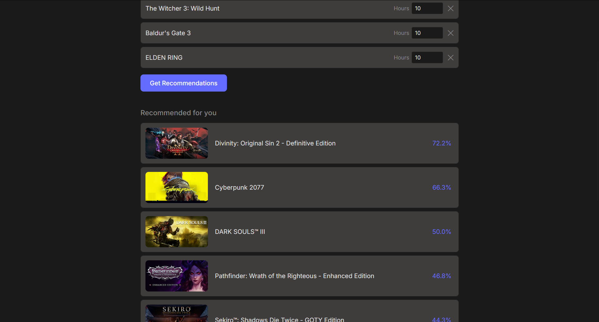

# GREC - Game Recommendation Engine

GREC lets you search for a Steam game and get a ranked list of similar titles. Recommendations are driven by a hybrid engine combining **content-based filtering** (tags, genres, and descriptions), a Wilson score quality boost, and **collaborative filtering** using Alternating Least Squares (ALS). Additionally, it allows you to create a profile of games you own and get recommendations based on your profile.

## How it works

1. **Pipeline** - downloads the [Steam Games Dataset](https://www.kaggle.com/datasets/fronkongames/steam-games-dataset) from Kaggle, cleans the data, builds a composite feature vector per game, and stores everything in PostgreSQL via `pgvector`. Trains the ALS model on the [Game Recommendations on Steam Dataset](https://www.kaggle.com/datasets/antonkozyriev/game-recommendations-on-steam).
2. **Backend** - a FastAPI app that serves game search, detail, and recommendation endpoints.
3. **Frontend** - a React + Vite app where users search for a game and explore similar titles.

The `/notebooks` directory contains experimentation and analysis covering the data cleaning and feature engineering decisions.

## Running locally

Requirement: [Docker](https://docs.docker.com/get-docker/)

**First time setup** - clone the repository, build images, populate the database, then start the app:

```bash
git clone https://github.com/Blaxelt/grec.git
cd grec
docker compose build
docker compose run pipeline   # downloads data and populates the DB (takes a while)
docker compose up
```

The app will be available at [http://localhost](http://localhost).

**Subsequent runs** - the database is persisted in a Docker volume, so just:

```bash
docker compose up
```

> **Re-running the pipeline** - only needed if you want to refresh the data. The pipeline image (`grec-pipeline`) can be removed after the initial setup to free disk space (~2 GB) without affecting the app.

## Screenshots

### Homepage



### Searching



### Results



### Game details





### Profile





## Tech stack

- **Feature store** - PostgreSQL + pgvector
- **Embeddings** - `sentence-transformers`
- **Collaborative filtering** - `implicit`
- **Backend** - FastAPI + SQLModel
- **Frontend** - React + Vite + TanStack Query
- **CI** - GitHub Actions

## License

This project is licensed under the [MIT License](LICENSE).
