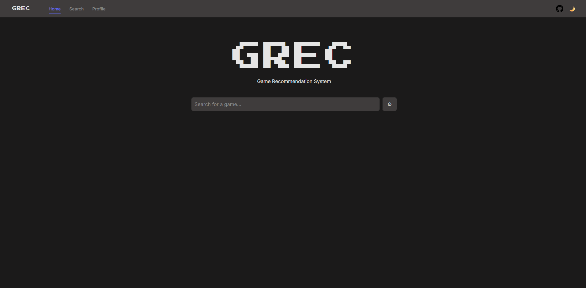
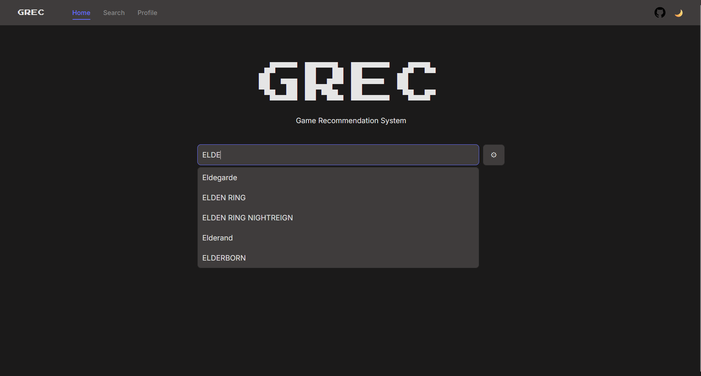
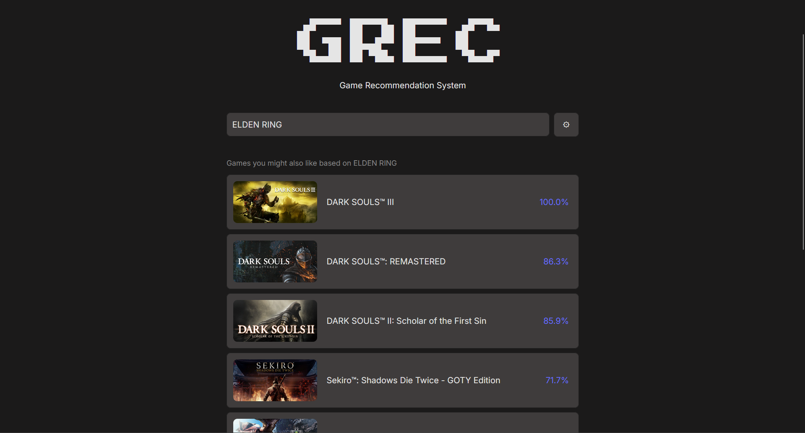
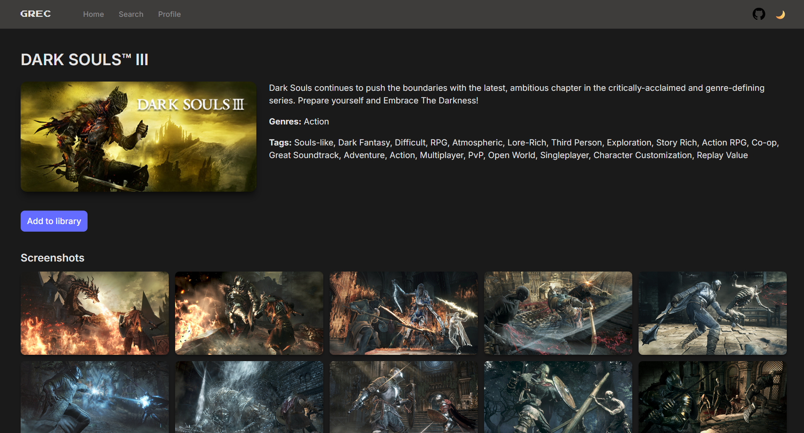
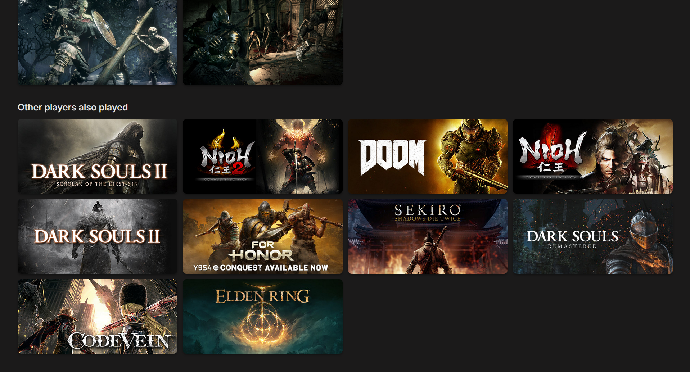
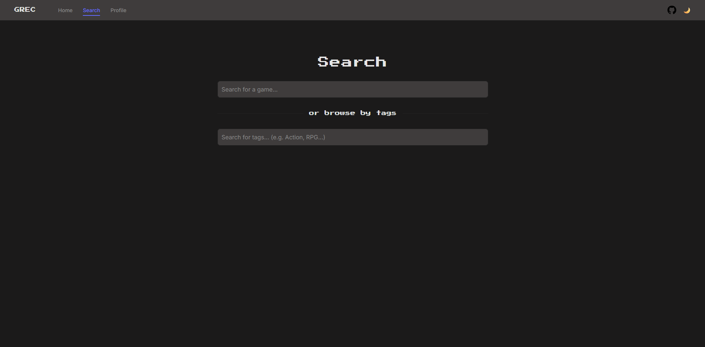
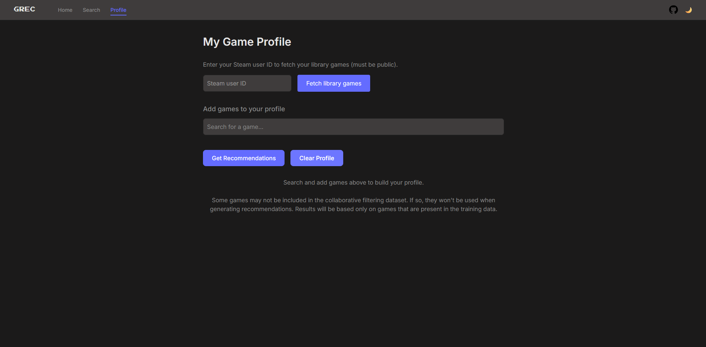
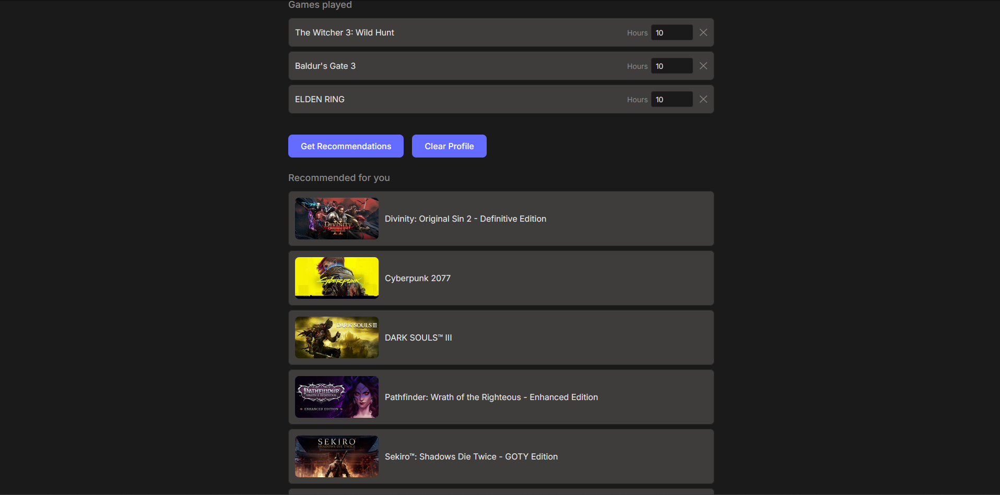
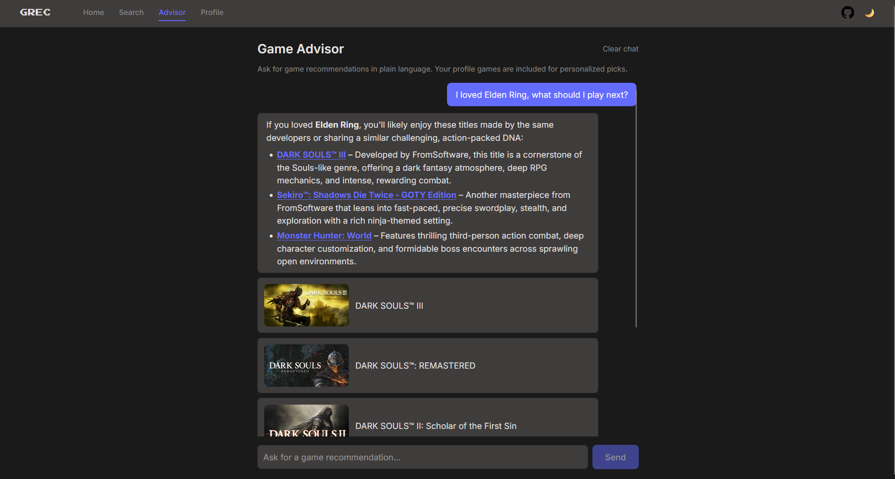

# GREC - Game Recommendation System

GREC lets you search for a Steam game and get a ranked list of similar titles. Recommendations are driven by a hybrid engine combining **content-based filtering** (tags, genres, and descriptions), a Wilson score quality boost, and **collaborative filtering** using Alternating Least Squares (ALS). Additionally, it allows you to create a profile of games you own and get recommendations based on your profile.

GREC also includes a chat assistant built with LangGraph that uses retrieval-augmented generation (RAG): it fetches real game data via tools, then grounds every answer in those facts. It understands natural-language requests and answers with database-backed recommendations through a conversational interface.

Try it live at [grec.blaxelt.com/](https://grec.blaxelt.com/).

The application is deployed using Docker containers on a VPS, reverse-proxied through Caddy, with automated deployments via GitHub Actions.

## How it works

1. **Pipeline** - downloads the [Steam Games Dataset](https://www.kaggle.com/datasets/fronkongames/steam-games-dataset) from Kaggle, cleans the data, builds a composite feature vector per game, and stores everything in PostgreSQL via `pgvector`. Trains the ALS model on the [Game Recommendations on Steam Dataset](https://www.kaggle.com/datasets/antonkozyriev/game-recommendations-on-steam).
2. **Backend** - a FastAPI app that serves game search, detail, recommendation, and chat endpoints. The chat endpoint is powered by a **LangGraph agent** that uses LangChain tools to query the database, search by tags, and call both content-based and collaborative recommenders.
3. **Frontend** - a React + Vite app where users search for a game, explore similar titles, build a game profile, and chat with the AI advisor for personalized or descriptive recommendations.

The `/notebooks` directory contains experimentation and analysis covering the data cleaning and feature engineering decisions.

## Running locally

Requirement: [Docker](https://docs.docker.com/get-docker/)

**First time setup** - clone the repository:

```bash
git clone https://github.com/Blaxelt/grec.git
cd grec
```

**Configuration** - You need a Steam API key to enable the Steam game library import feature. Get one [here](https://steamcommunity.com/dev/apikey). For the Game Advisor chat, you also need a Google AI Studio API key (free tier, [get one here](https://aistudio.google.com/apikey)). Create a `.env` file in the root directory:

```bash
echo "STEAM_API_KEY=your_steam_api_key" > .env
echo "CHAT_MODEL=google_genai:gemini-3.5-flash-lite" >> .env
echo "GOOGLE_API_KEY=your_ai_studio_key" >> .env
```

The chat agent uses a provider-agnostic model string (`CHAT_MODEL`). To use a different provider (OpenAI, Anthropic...), change `CHAT_MODEL`, install the corresponding LangChain provider package (e.g. `langchain-openai`), and set the provider's API key env var (e.g. `OPENAI_API_KEY`, `ANTHROPIC_API_KEY`).

**Start the app** - build the images, populate the database, and start the app:

```bash
docker compose build
docker compose run pipeline   # downloads data and populates the DB (takes a while)
docker compose up
```

The app will be available at [http://localhost](http://localhost).

**Subsequent runs** - the database is persisted in a Docker volume, so just:

```bash
docker compose up
```

> **Re-running the pipeline** - only needed if you want to refresh the data. The pipeline image (`grec-pipeline`) can be removed after the initial setup to free disk space (~2 GB) without affecting the app.

## Screenshots

### Homepage



### Searching



### Results



### Game details





### Search Page



### Profile





### Game Advisor



## Tech stack

- **Feature store** - PostgreSQL + pgvector
- **Embeddings** - `sentence-transformers`
- **Collaborative filtering** - `implicit`
- **AI Agent** - LangGraph + LangChain (agent with tools)
- **Backend** - FastAPI + SQLModel
- **Frontend** - React + Vite + TanStack Query
- **CI/CD** - GitHub Actions

## Limitations

Some features, such as the **profile page recommendations** and the **"Other players also played"** section, are limited to a subset of the game catalog. This occurs because the collaborative filtering dataset used to train the model does not cover every game.

The **Game Advisor** requires a Google AI Studio API key (free tier available). Without one, the chat page is accessible but the assistant returns a configuration error. When a game or tag is not in the database, the agent falls back to its general knowledge with an explicit disclaimer.

## License

This project is licensed under the [MIT License](LICENSE).
